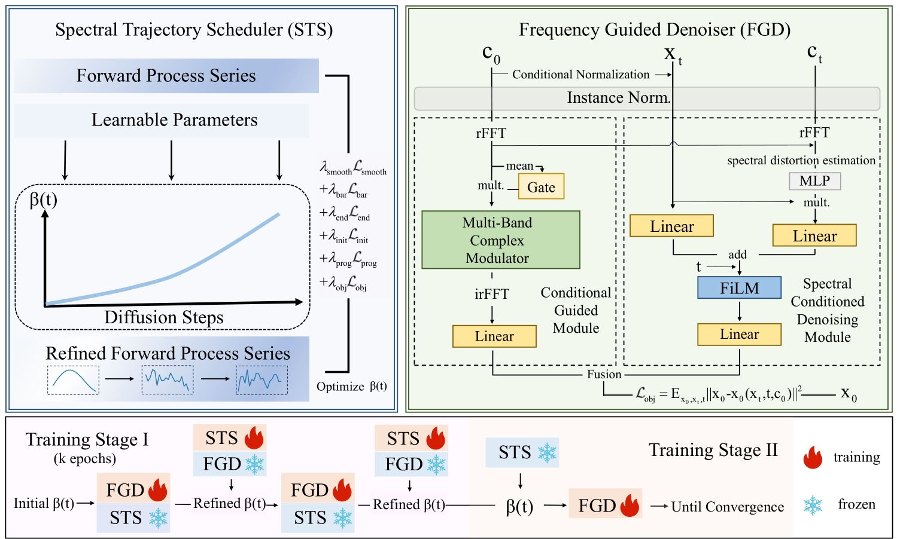

The paper is under review.

# 1 NsDiff
NsDiff is a diffusion based framework for probabilistic time series forecasting that couples noise scheduling with denoising to better align corruption and restoration.

<p align="center">
  
</p>


# 2 install requirements

```
conda activate myenv
```
```
pip install -r ./requirements.txt
```

# 3 run

```
chmod +x scripts/StaTS/all.sh && bash scripts/StaTS/all.sh
```

